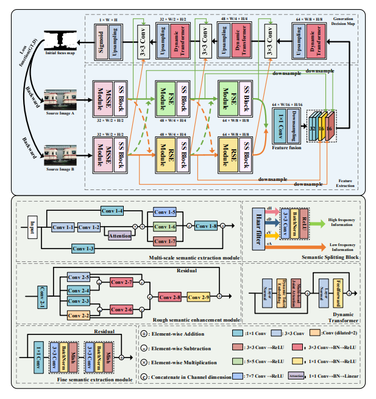

# MSI-DTrans (DISPLAYS, 2024)：
Code for paper [MSI-DTrans: a multi-focus image fusion using multilayer semantic interaction and dynamic transformer](https://www.sciencedirect.com/science/article/abs/pii/S0141938224002014).  
你可以在此处下载所有代码(You can download all the code in this branch)  
  
Train.py -- 训练我们的网络（Train our network）  
Eval.py -- 利用训练好的网络参数进行图像融合（Fusion images through network）
  
# ------------------Reference information--------------------  
如果我们的工作对您有所启发，欢迎引用以下信息。  
If this work is helpful to you, please citing our work as follows:  
  
```  
@article{zhai2024msi,
  title={MSI-DTrans: A multi-focus image fusion using multilayer semantic interaction and dynamic transformer},  
  author={Zhai, Hao and Ouyang, Yuncan and Luo, Nannan and Chen, Lianhua and Zeng, Zhi},  
  journal={Displays},  
  pages={102837},  
  year={2024},  
  publisher={Elsevier}  
}
```
  
<p style="color:red">or</p>
  
```  
Zhai H, Ouyang Y, Luo N, et al. MSI-DTrans: A multi-focus image fusion using multilayer semantic interaction and dynamic transformer[J]. Displays, 2024: 102837.  
```  
  
# ----------------------Article Preview------------------------  
Abstruct:  
Multi-focus image fusion (MFIF) aims to utilize multiple images with different focal lengths to fuse into a single full-focus image. This process enhances the realism and clarity of the resulting image. In this paper, a MFIF method called MSI-DTrans was proposed. On the one hand, in order to fully utilize all the effective information that the source image carries, the proposed method adopts a multilayer semantic interaction strategy to enhance the interaction of high-frequency and low-frequency information. This approach gradually mines more abstract semantic information, guiding the generation of feature maps from coarse to fine. On the other hand, a parallel multi-scale joint self-attention computation model is designed. The model adopts dynamic sense field and dynamic token embedding to overcome the performance degradation problem when dealing with multi-scale objects. This enables self-attention to integrate long-range dependencies between objects of different scales and reduces computational overhead. Numerous experimental results show that the proposed method effectively avoids image distortion, achieves better visualization results, and demonstrates good competitiveness with many state-of-the-art methods in terms of qualitative and quantitative analysis, as well as efficiency comparison.  


<div align="center">
  
</div>
  
# -----------------------Recommend---------------------------  
  
欢迎参考和引用我们的最新工作[FusionGCN](https://www.sciencedirect.com/science/article/pii/S0957417424025326) (ESWA, 2025)  
Welcome to refer to and cite our latest work [FusionGCN](https://www.sciencedirect.com/science/article/pii/S0957417424025326) (ESWA, 2025)  
代码已同步更新至我的仓库  
The code has been synchronized and updated to my repository
